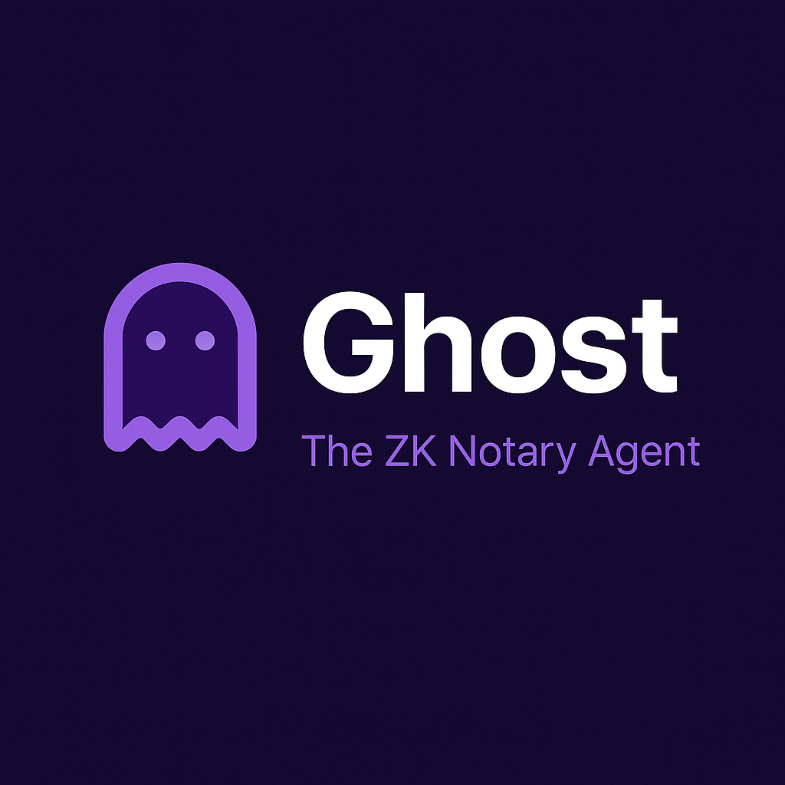

# Ghost: The ZK Notary Agent

<figure><figcaption></figcaption></figure>

Welcome to the comprehensive documentation for Ghost, a privacy-focused application that enables users to create and verify Zero-Knowledge Proofs (ZKPs) on the Internet Computer blockchain.

## About This Documentation

This documentation is organized into several main sections:

* **Core Documentation**: Essential information about Ghost, including introduction, architecture, and getting started guides
* **Developer Resources**: Technical documentation for developers looking to build with or contribute to Ghost
* **Additional Information**: Supplementary information including security considerations, roadmap, and troubleshooting

## Quick Links

* 🚀 [Getting Started](getting-started/)
* 📖 [User Guide](user-guide/)
* 💻 [Developer Documentation](developer-documentation/)
* 🔒 [Security Considerations](security/)
* 🛠 [API Reference](api-reference/)

## Support

If you need help or have questions:

1. Check the [Troubleshooting](troubleshooting/) section
2. Review [Common Issues](troubleshooting/common-issues.md)
3. Access our [Support Resources](troubleshooting/support-resources.md)

## Contributing

We welcome contributions! Please see our [Contributing Guide](contributing/) for details on how to get involved.

## License

Ghost is licensed under the MIT License. See the LICENSE file for details.
